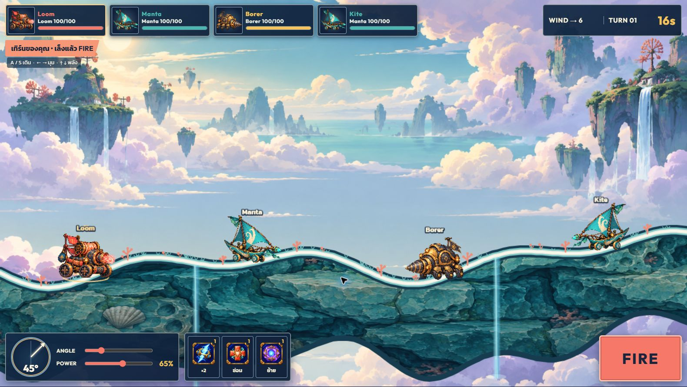

# Skyward Salvage

เกมยิงผลัดกันเล่นบนเว็บสำหรับ 2–4 คนในห้องส่วนตัว พัฒนาจากภาพแนวทางที่อนุมัติแล้ว โดยแยกจากโครงการ `arcane_relay`.



## เริ่มเล่นบนเครื่องนี้

ต้องมี Node.js 20.19+ หรือ 22.12+.

```powershell
cd D:\workshop\skyward_salvage
npm install
npm run dev
```

เปิด `http://localhost:5173` สร้างห้อง แล้วส่งลิงก์ห้องให้เพื่อนอีก 1–3 คน หากเปิดจากเครื่องอื่นในเครือข่ายเดียวกัน ให้ใช้ IP ของเครื่องที่รันเซิร์ฟเวอร์แทน `localhost` และเปิดพอร์ตที่เกี่ยวข้องตามการตั้งค่าเครือข่ายของคุณ

## รันแบบเซิร์ฟเวอร์เดียว

```powershell
npm run build
npm start
```

เปิด `http://localhost:3001` หรือกำหนด `PORT` ก่อนสั่ง `npm start`. การเล่นกับเพื่อนผ่านอินเทอร์เน็ตต้องนำ Node server นี้ขึ้นโฮสต์ที่เข้าถึงได้จากภายนอก พร้อม HTTPS/WSS. โค้ดเกมและห้องออนไลน์พร้อมใช้งาน แต่ยังไม่ได้เผยแพร่ไปยังโฮสต์สาธารณะ

หากใช้โดเมนสาธารณะ ให้ตั้ง `ALLOWED_ORIGINS` เป็น origin ที่อนุญาต คั่นหลายค่าด้วยจุลภาค เช่น `https://game.example.com` เซิร์ฟเวอร์ตรวจ Origin ของ WebSocket, จำกัดขนาดข้อความและความถี่คำสั่ง และตรวจการเชื่อมต่อที่ค้างด้วย ping/pong. ห้องและสถิติยังอยู่ในหน่วยความจำของ Node process เดียว จึงควรตั้งโฮสต์ให้ทำงานต่อเนื่องระหว่างแมตช์

## วิธีเล่น

1. ใส่ชื่อแล้วสร้างหรือเข้าห้องด้วยรหัส 6 ตัว จากนั้นเลือก Mobile ในห้องเตรียมเกมจาก Loom, Manta, Borer, Vesper และ Bramble หรือกดสุ่มได้หนึ่งครั้งต่อห้อง ผลสุ่มจะเปิดเผยเมื่อเข้าหน้าจอเกมเท่านั้น (มีโอกาส 5% ได้ Aegis พลังชีวิต 150) หากต้องการทดลองคนเดียว เลือก Mobile แล้วกด **ฝึกยิงคนเดียว** ที่หน้าแรก
2. ผู้เล่นที่ไม่ใช่หัวหน้าห้องกด **พร้อมเล่น** หลังเลือก Mobile แล้ว หัวหน้าห้องเลือกระหว่างทุกคนสู้กันและทีม 2v2 แล้วกดเริ่มเมื่อมี 2–4 คนและทุกคนพร้อม โหมดทีมต้องมี 4 คน ทีม A/B สลับตามลำดับเข้าห้องและกระสุนไม่ทำร้ายเพื่อนร่วมทีม
3. เทิร์นของคุณมี 30 วินาที กด **←/→ หรือ A/D** เพื่อเดินตามพื้นสนามได้รวมสูงสุด 175 หน่วยต่อเทิร์น (ประมาณหนึ่งคันครึ่ง) และ **↑/↓ หรือ W/S** เพื่อปรับมุมยิง 10–80° จากด้านหน้ารถ กด **R** เพื่อหันไปยิงอีกฝั่งโดยไม่ต้องเดิน บนมือถือกดปุ่ม **⚙ ตั้งค่า** มุมขวาบนเพื่อเปิดปุ่มลูกศรบนหน้าจอ
4. กดปุ่ม **FIRE** หรือ **Space** ค้างไว้เพื่อชาร์จพลังจาก 5% ถึง 100% แถบ POWER จะค่อย ๆ เพิ่ม แล้วปล่อยปุ่มเพื่อยิง กดปุ่ม **กระสุน: โจมตี/ขุดพื้น** หรือ **Q** เพื่อสลับชนิดกระสุน กระสุนขุดพื้นสร้างหลุมใหญ่ขึ้นตาม Mobile แต่ทำดาเมจน้อยลง ท่าพิเศษและ WARP จะกลับไปใช้กระสุนปกติ
5. ดูทิศและแรงลมบน HUD. ทุกคันเริ่มเล็งที่ 45° จากด้านหน้ารถ และจำมุมล่าสุดไว้สำหรับเทิร์นต่อไป ลมมีโอกาสเปลี่ยน 20% เมื่อขึ้นเทิร์นใหม่ รถจะเอียงตามพื้นสนามหลังถูกยิงจนเปลี่ยนรูป สภาพอากาศแสดงในห้องเตรียมเกมก่อนเริ่มรอบ: ฟ้าโปร่งใช้วิถีปกติ, ลมแรงเพิ่มผลของแรงลม 50%, แรงโน้มถ่วงต่ำทำให้กระสุนลอยนานขึ้น
6. ไอเทม **×2** เพิ่มดาเมจของนัดถัดไป 2 เท่า, **ซ่อม** ฟื้น 28 HP แล้วจบเทิร์น, **ย้าย** กดเลือกไอเทม เล็งมุม แล้วชาร์จยิงกระสุนวาร์ปไปยังจุดตกเพื่อย้ายตำแหน่งและจบเทิร์น
7. ปุ่ม **ท่าพิเศษ** ใช้ได้หนึ่งครั้งต่อรอบ และเติมใหม่ได้เมื่อเก็บไอเทมท่าพิเศษหลังใช้ไปแล้ว: Loom ยิงแม่นและแรงขึ้น, Manta แตกเป็นสามกระสุน, Borer ระเบิดพื้นที่กว้างขึ้น, Vesper ยิงโดยไม่ถูกลมพัด, Bramble ยิงเมล็ดพืชพร้อมฟื้นพลังให้ตัวเอง
8. ทุก ๆ 8 เทิร์นจะมีไอเทมแบบสุ่มตกลงบนสนาม: ×2, ซ่อม และย้าย อย่างละ 30%; เติมท่าพิเศษ 10% เดินหรือย้ายตำแหน่งไปเก็บได้เมื่อช่องของไอเทมชนิดนั้นว่าง
9. ไม่มีเส้นคาดการณ์วิถีกระสุนระหว่างเล็ง ต้องกะระยะจากมุม พลัง และแรงลมเอง
10. ผู้เล่นหรือทีมสุดท้ายที่เหลือ HP ชนะ หลังจบรอบมีสถิติ จากนั้นทุกคนกดรีแมตช์เพื่อกลับห้องเตรียมเกม เลือกรถใหม่และกดพร้อมก่อนหัวหน้าห้องเริ่มรอบต่อไป

โหมดฝึกมีเป้านิ่งที่ฟื้นพลังหลังทุกนัด เล่นได้โดยไม่จับเวลาและไม่ต้องรอผู้เล่นอื่น ใช้ปุ่มตั้งค่าเพื่อเริ่มสนามฝึกใหม่หรือออกจากโหมดฝึก

หากเน็ตหลุดหรือรีเฟรชหน้าเดิม เบราว์เซอร์จะกลับเข้าห้องอัตโนมัติภายใน 45 วินาที เทิร์นของผู้ที่หลุดจะผ่านไปเพื่อไม่ให้ทั้งห้องรอ เมื่อหมดเวลาดังกล่าวผู้เล่นที่ยังไม่กลับจะถูกนำออกจากรอบ

กด **⚙ ตั้งค่า** ระหว่างเกมเพื่อเปิด/ปิด **BGM** และ **SFX** แยกกันได้ ตัวเลือกจะจำไว้ในเบราว์เซอร์ SFX รวมเสียงเดินรถ ยิง ถูกยิง ไอเทม ท่าพิเศษ ไอเทมตก ลมเปลี่ยน และเสียงนาฬิกาเตือนใน 5 วินาทีสุดท้ายของเทิร์น

## ทดสอบ

```powershell
npm test
npm run build
```

`npm test` ตรวจระบบยิง/ไอเทม/การเดิน/ท่าพิเศษ/ทีม/ไอเทมตก/การกดพร้อม/กระสุนขุดพื้น/สภาพอากาศ/โหมดฝึก และเปิดเซิร์ฟเวอร์ WebSocket จริงเพื่อทดสอบว่าห้อง 2, 3, 4 ไคลเอนต์เห็นตำแหน่ง การยิง และการย้ายตำแหน่งตรงกัน รวมทั้งการกลับเข้าห้อง

## โครงสร้าง

- `shared/game.ts` — กติกา ฟิสิกส์เทิร์น ลม กระสุน พื้นและไอเทม
- `server/index.ts` — ห้องส่วนตัวและสถานะเกมที่เซิร์ฟเวอร์เป็นผู้ตัดสิน
- `src/GameScene.ts` — ภาพสนาม Mobile และเอฟเฟกต์ใน Phaser
- `src/main.ts`, `src/style.css` — ห้องรอและ HUD
- `public/assets/environment/` — ฉากหลังจาก imagegen
- `public/assets/terrain/` — ผิวหินของเกาะลอยฟ้าจาก imagegen
- `public/assets/characters/`, `public/assets/ui/` — Mobile และไอคอนไอเทมพื้นหลังโปร่งใสจาก imagegen
- `public/assets/sound/` — เพลงพื้นหลังและเสียงเอฟเฟกต์ที่ใช้ในเกม
- `DESIGN.md` — กติกาและขอบเขตเวอร์ชันแรก

แนวทางภาพที่อนุมัติและชุดภาพตัวอย่างอยู่ใน [`art_review/ART_REVIEW.md`](art_review/ART_REVIEW.md).
พรอมป์ตที่ใช้สร้าง Vesper, Bramble และ Aegis อยู่ใน [`art_review/MOBILE_ADDITIONS.md`](art_review/MOBILE_ADDITIONS.md).
