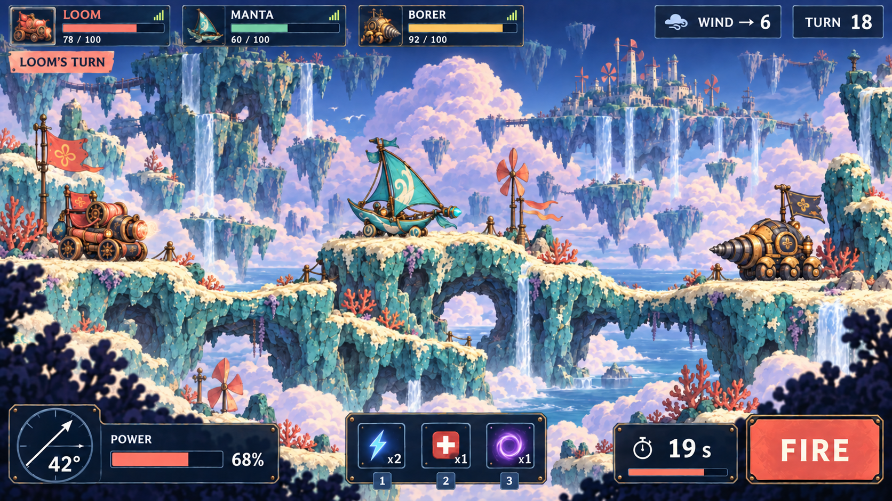
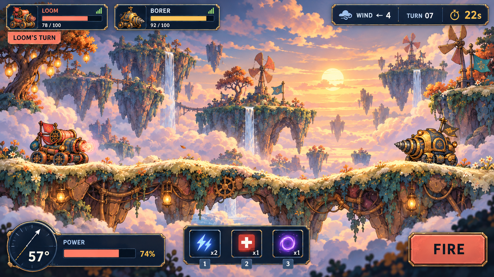
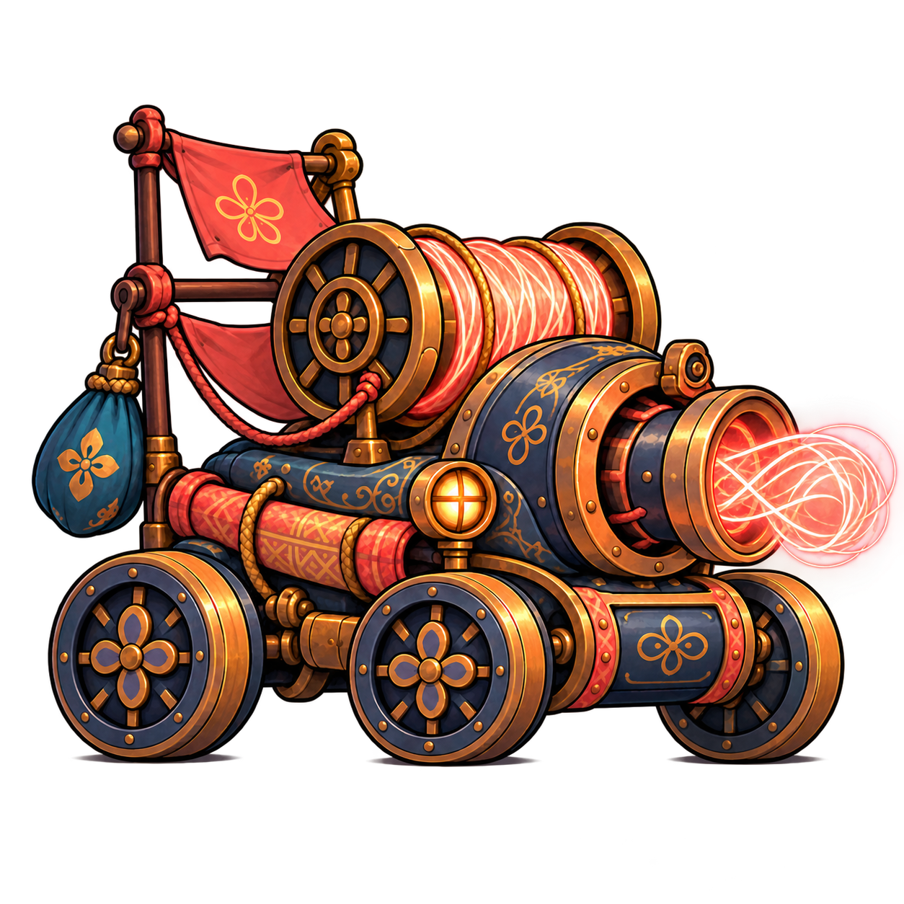
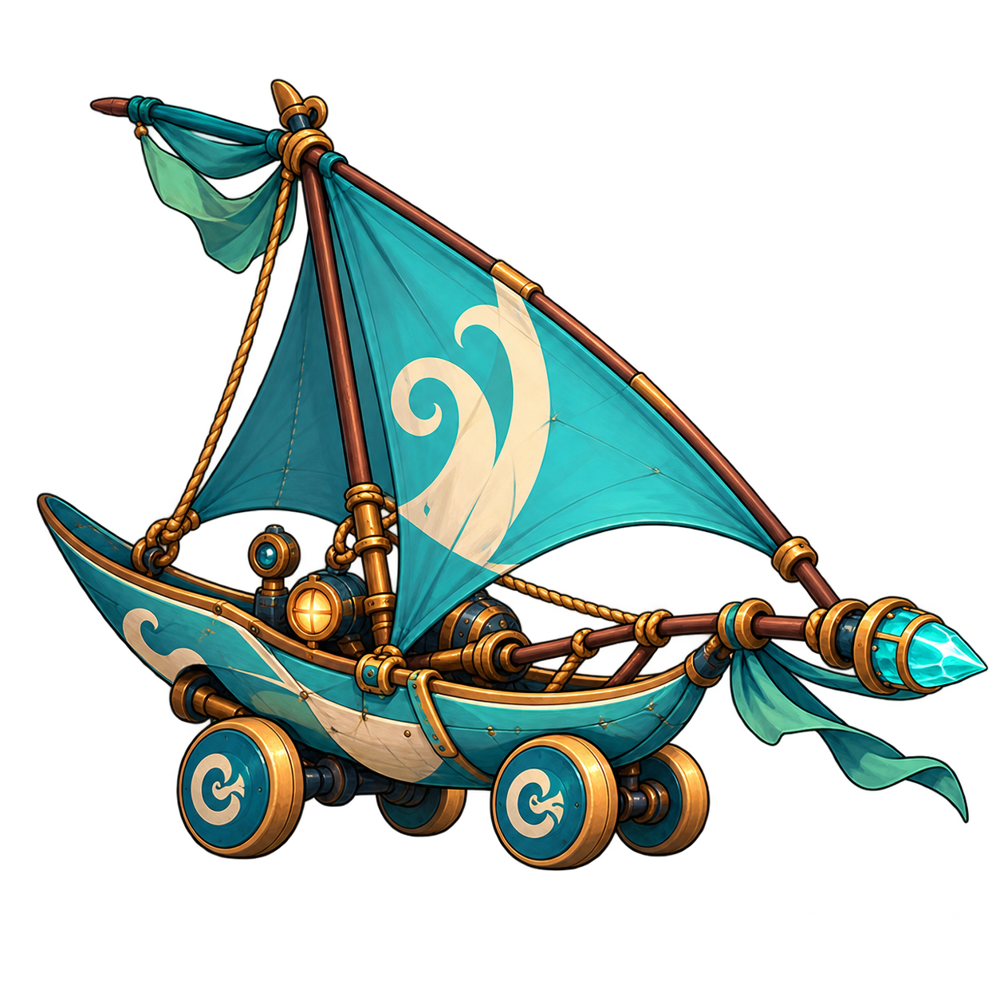
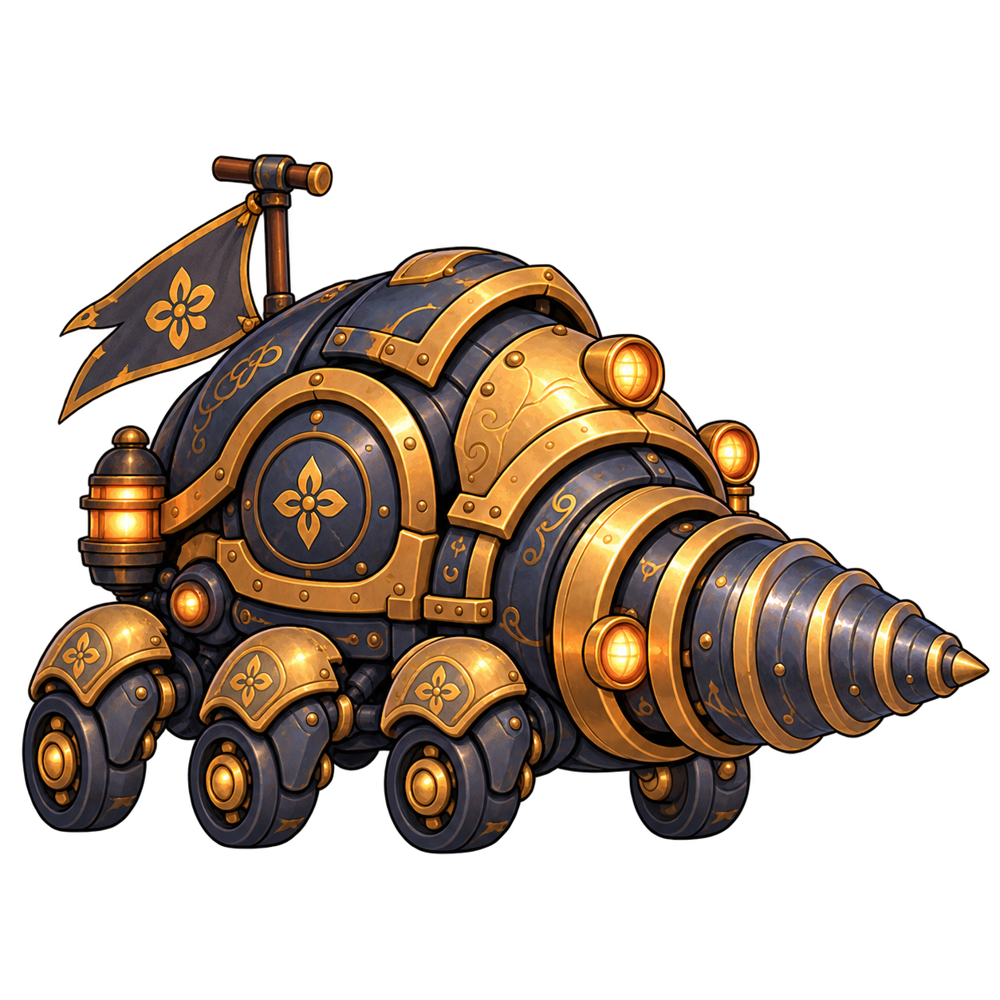
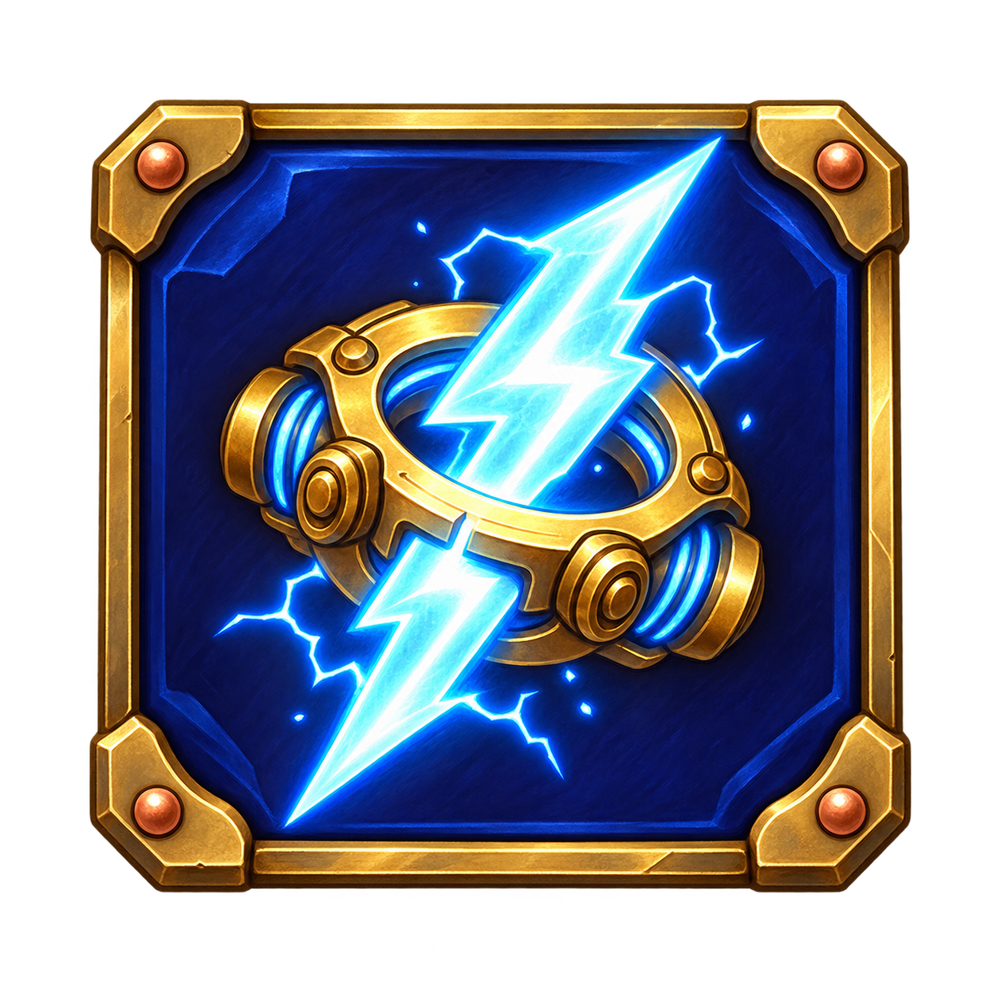
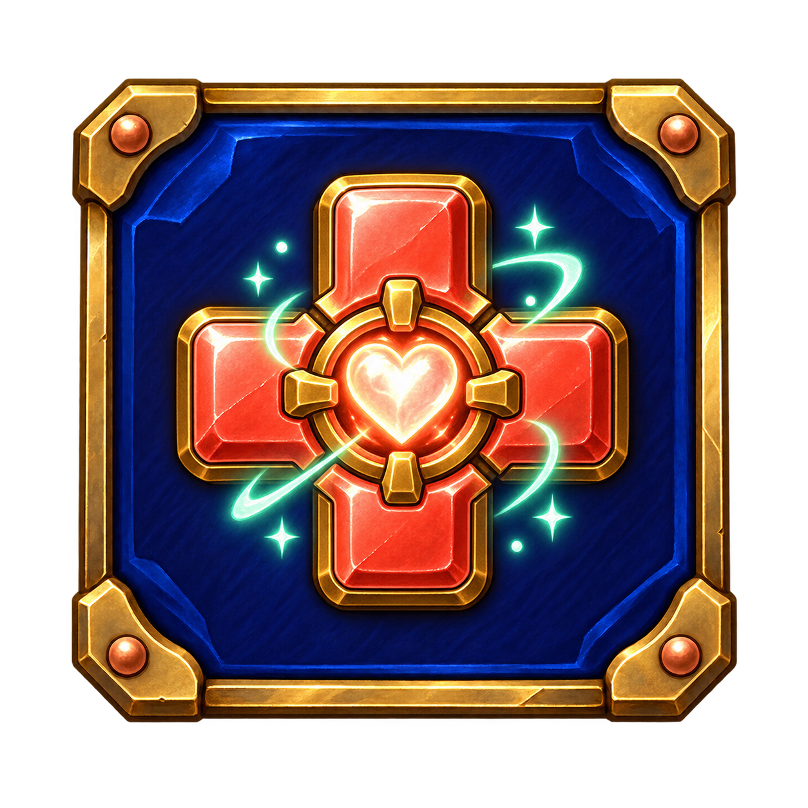
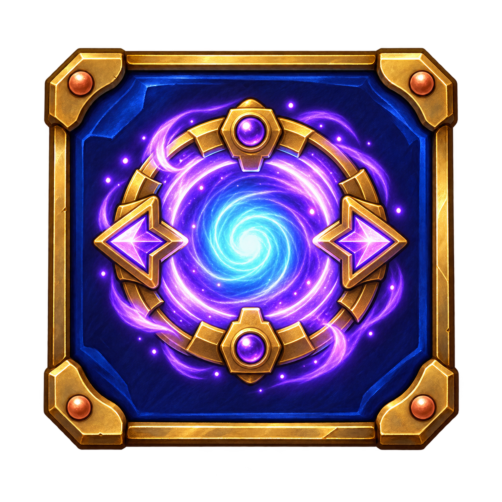

# Skyward Salvage — รอบตรวจทิศทางภาพ 2

ภาพที่ 1 ของผู้ใช้เป็นหน้าจอเกมปัจจุบัน ภาพที่ 2 ใช้อ้างอิงระดับรายละเอียด บรรยากาศ และลำดับข้อมูลบน HUD เท่านั้น ภาพตัวอย่างชุดนี้ไม่ใช้เส้นคาดการณ์วิถีกระสุนและออกแบบ Mobile ของ Skyward Salvage เอง

## ภาพหน้าจอเป้าหมาย

### เกาะเมฆ — 3 ผู้เล่น

### สวนกลไก — 2 ผู้เล่น

ทั้งสองภาพเป็น mockup สำหรับยืนยันทิศทาง ยังไม่ใช่ภาพหน้าจอจากเกมที่รันจริง ตำแหน่ง HUD และพื้นสนามจะถูกแปลงเป็นระบบที่รองรับจำนวนผู้เล่นและรูปทรงพื้นแบบสุ่ม หลังอนุมัติภาพ

## Mobile ที่เลือกสำหรับการนำไปใช้

| ชื่อ | ภาพ | สี/รูปร่างเด่น |
| --- | --- | --- |
| Loom |  | รถม้วนด้ายสีคอรัลกับปืนด้ายพลังงาน |
| Manta |  | เรือใบติดล้อสีเทอร์ควอยซ์ |
| Borer |  | รถด้วงเจาะพื้นสีทองกับเปลือกเกราะเข้ม |

## ไอเทม

| ผล | ภาพ |
| --- | --- |
| เพิ่มดาเมจ 2 เท่า |  |
| ซ่อม HP |  |
| กระสุนย้ายตำแหน่ง |  |

Mobile ที่เลือกทั้งสามและไอคอนทั้งสามเป็น PNG 1254×1254 แบบ RGBA โดยพิกเซลมุมโปร่งใส (`alpha = 0`) เพื่อพร้อมจัดขนาดแสดงผลร่วมกัน ภาพ Loom ต้นฉบับแบบแนวนอน (`mobile-loom.png`) เก็บไว้เป็นตัวเลือกสำรอง; `mobile-loom-square.png` เป็นภาพที่เลือกใช้ในชุดนี้

ภาพ Cloud Reef ฉบับแรก (`screen-cloud-reef-3p.png`) เก็บเป็นตัวเลือกสำรอง; `screen-cloud-reef-3p-solid-dial.png` เป็นฉบับที่เลือก เพราะเข็มมุมยิงเป็นเส้นทึบและไม่มีเส้นจุด

## แนวทางภาพและ HUD

- ฉากหลังแยกชั้นไกล/กลาง/หน้า: ท้องฟ้า เมฆ เกาะลอย น้ำตก และกังหันลม; พื้นที่เดินได้ใช้สันดินต่อเนื่องเพื่อเข้ากับระบบ collision ปัจจุบัน
- ขอบพื้นที่เดินได้สีครีมสว่างกว่าเนื้อหินชัดเจน เพิ่มผิวหิน รากไม้และพืชประดับโดยไม่บัง Mobile
- HP และภาพ Mobile อยู่ในบัตรด้านบน 2–4 ใบ; ลม เทิร์น และเวลาอยู่มุมบนขวา; มุม พลัง ไอเทม และ FIRE ชิดขอบล่าง
- ลบเส้นจุดคาดการณ์ตอนเล็งและเส้นทางกระสุนที่เกมวาดระหว่างแอนิเมชันยิง เหลือเฉพาะตัวกระสุนและเอฟเฟกต์ตกกระทบ
- ปุ่ม A/S จะขยับเฉพาะ Mobile ที่กำลังเล่นโดยเซิร์ฟเวอร์ถือสถานะจริง; ลูกศรควบคุมมุมและพลัง; ไอเทมย้ายตำแหน่งจะยิงกระสุนตามฟิสิกส์เดียวกับการยิงปกติ

## Prompt set และวิธีสร้าง

สร้างด้วย built-in imagegen โดยใช้ภาพที่ 2 เป็น reference ด้านคุณภาพและ HUD ใช้แผ่นภาพร่าง Mobile เดิมเป็น reference ตัวตนของตัวละคร Prompt หลักสำหรับหน้าจอคือ *original illustrated floating-island artillery game screen, richly layered traversable terrain, clouds, waterfalls, compact portrait health cards and edge HUD, no dotted line, no predicted trajectory, no guideline*. Prompt Mobile แยกสามใบคือ *transparent broadside right-facing copper coral spool cart / teal wheeled sail skiff / golden beetle drill crawler, consistent game sprite framing*. Prompt ไอเทมแยกสามใบคือ *transparent square indigo enamel and brass-rim tile, centered blue double-power bolt / coral repair cross / violet teleport gate*. ภาพทั้งหมดเป็นผลงานสำหรับ Skyward Salvage และยังไม่ถูกนำไปแทน asset ในเกม
